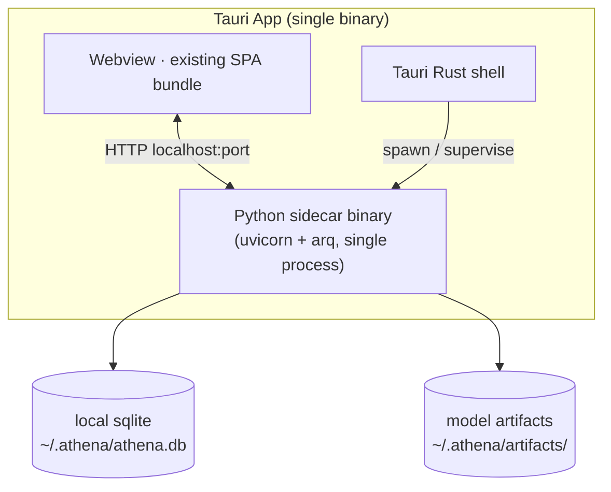

# Local-First with Tauri

Goal: a single installable for macOS / Windows / Linux that runs Athena entirely on a user's laptop. No login, no cloud, no upload. Their molecules, their models, their compute.

!!! warning "This is a design sketch, not a guide"
    Nothing here is built yet. Numbers and library versions are valid as of the doc date and will rot.

## Why local-first matters for Athena

- Drug-discovery teams often work with proprietary structures. "Don't upload it to the internet" is the default policy.
- Local SQLite is dramatically faster than round-tripping every metric write to Postgres-over-WAN.
- GPU users have their own GPU; cloud Athena can't compete with `cuda:0` on the box.

## Architecture



Everything is the **same code** as the cloud monolith — different *deployment* of it. That's the whole point of building the monolith first.

## Key technical decisions

### 1. Python sidecar via PyInstaller

We don't try to compile Python to WASM or rewrite the backend in Rust. The cloud Athena code ships **as-is** as a sidecar binary built with [PyInstaller](https://pyinstaller.org).

Spike command (don't expect this to work without iteration):

```bash
cd backend
uv pip install pyinstaller
pyinstaller \
  --onefile \
  --name athena-backend \
  --collect-all huggingface_hub \
  --collect-all datasets \
  --collect-all mlflow \
  --collect-all rdkit \
  --hidden-import asyncpg \
  athena/main.py
```

Output: `dist/athena-backend(.exe)` — a 200–400 MB binary. Heavy because RDKit + MLflow + HF bring their own data files.

**Open questions to validate during a spike:**

- Does PyInstaller correctly bundle the C extensions for `rdkit`, `lightgbm`, `cryptography`? (Usually yes with the `--collect-all` flags, but verify on all three OSes.)
- Cold-start time: PyInstaller `--onefile` extracts to tmp on every run. `--onedir` is faster but creates a folder Tauri has to manage. For a desktop app, **`--onedir` is better**.
- Code signing on macOS: Apple notarization requires signing every shared library inside the bundle. Use `tauri-cli`'s `signing` step for the outer `.app` and `--osx-bundle-identifier` on PyInstaller for the inner sidecar.

### 2. Tauri sidecar contract

Tauri 2 has [first-class sidecar support](https://v2.tauri.app/develop/sidecar/). Drop the binary at `src-tauri/binaries/athena-backend-<target-triple>`. Declare it in `tauri.conf.json`:

```json
{
  "bundle": {
    "externalBin": ["binaries/athena-backend"]
  },
  "plugins": {
    "shell": {
      "sidecar": true,
      "scope": [{ "name": "binaries/athena-backend", "sidecar": true }]
    }
  }
}
```

Spawn from Rust on app boot, then point the webview at the sidecar:

```rust
// src-tauri/src/main.rs (sketch)
use tauri_plugin_shell::ShellExt;

fn main() {
    tauri::Builder::default()
        .plugin(tauri_plugin_shell::init())
        .setup(|app| {
            let port = pick_free_port();
            let sidecar = app.shell().sidecar("athena-backend")?
                .args(["--port", &port.to_string()]);
            let (_rx, _child) = sidecar.spawn()?;
            // store port in a tauri state struct so the webview can read it
            app.manage(BackendUrl(format!("http://127.0.0.1:{port}")));
            Ok(())
        })
        .run(tauri::generate_context!())
        .expect("error while running tauri application");
}
```

The webview reads the port via Tauri's IPC `invoke("get_backend_url")` and uses that as the base URL instead of `VITE_API_URL`.

**Look at `references/unsloth/frontend/src/components/tauri/`** — `startup-screen.tsx`, `update-banner.tsx`, `window-titlebar.tsx`. These are the exact patterns we'd reuse: show a startup screen until the sidecar reports ready, a custom titlebar (because Tauri removes the native one on macOS), and an updater banner.

### 3. Schema: SQLite, not Postgres

SQLAlchemy already supports both. The Tauri build sets:

```
DATABASE_URL=sqlite+aiosqlite:////Users/<user>/Library/Application Support/Athena/athena.db
MLFLOW_TRACKING_URI=sqlite:////Users/<user>/Library/Application Support/Athena/mlflow.db
MLFLOW_ARTIFACT_ROOT=/Users/<user>/Library/Application Support/Athena/artifacts
REDIS_URL=                                    # disabled — see below
```

### 4. Background jobs *without* Redis

Single-user laptop install — running Redis is overkill. Replace arq with the in-process [TaskGroup](https://docs.python.org/3/library/asyncio-task.html#asyncio.TaskGroup) pattern. Define an interface that both implementations satisfy:

```python
# athena/integrations/queue.py — adapter
import os

if os.getenv("REDIS_URL"):
    from .queue_redis import enqueue
else:
    from .queue_local import enqueue
```

…with `queue_local.py` running jobs in a background task on the same event loop. Same job signatures, zero changes to callers.

### 5. Auth: none

In local mode there's one user — the OS user. Skip the magic-link flow entirely and mint a permanent session token on first launch (Tauri stores it in the OS keychain via `tauri-plugin-stronghold`).

### 6. Auto-update

Tauri's updater plugin reads a JSON manifest from `https://athena.example.com/updates/latest.json` and downloads + verifies a signed binary. We publish updates from CI (GitHub Actions) on every tagged release.

### 7. Telemetry: opt-in only

Trust currency for local-first apps is **respect for privacy.** No Sentry, no PostHog by default. Add a settings toggle ("Help improve Athena") that flips a single env var the sidecar reads — same Sentry init code, just gated.

## Distribution

| OS | Format | CI step |
|---|---|---|
| macOS | `.dmg` + `.app` (notarized) | `tauri build --target universal-apple-darwin` |
| Windows | `.msi` (signed, EV cert recommended) | `tauri build --target x86_64-pc-windows-msvc` |
| Linux | `.AppImage` + `.deb` | `tauri build --bundles appimage deb` |

All three driven by `.github/workflows/desktop-release.yml` triggered on `v*` tags. Total CI minutes: ~25, dominated by the macOS notarization wait.

## What we don't need

- ❌ Electron — Tauri is smaller, faster, more secure.
- ❌ Rewriting the backend in Rust — premature.
- ❌ Bundling PostgreSQL — SQLite handles single-user workloads perfectly.
- ❌ Cloud sync from day one — make local-only work first; add optional sync later.

## Estimated work

- Sidecar packaging spike (PyInstaller across 3 OSes): **1 week**
- Tauri shell + sidecar plumbing: **1 week**
- Replace Redis-backed queue with in-process: **2 days**
- Auto-updater + CI release pipeline: **3 days**
- Code signing / notarization / Apple ID dance: **2 days plus rage**

Total: ~3 weeks for a single engineer, **after** the cloud version is stable.

## Read also

- `references/unsloth/frontend/src/components/tauri/` — Unsloth's own Tauri integration is a complete worked example.
- `references/unsloth-main/install.ps1` / `install.sh` — their installer pattern (used for sidecar drops on Windows/Linux).
