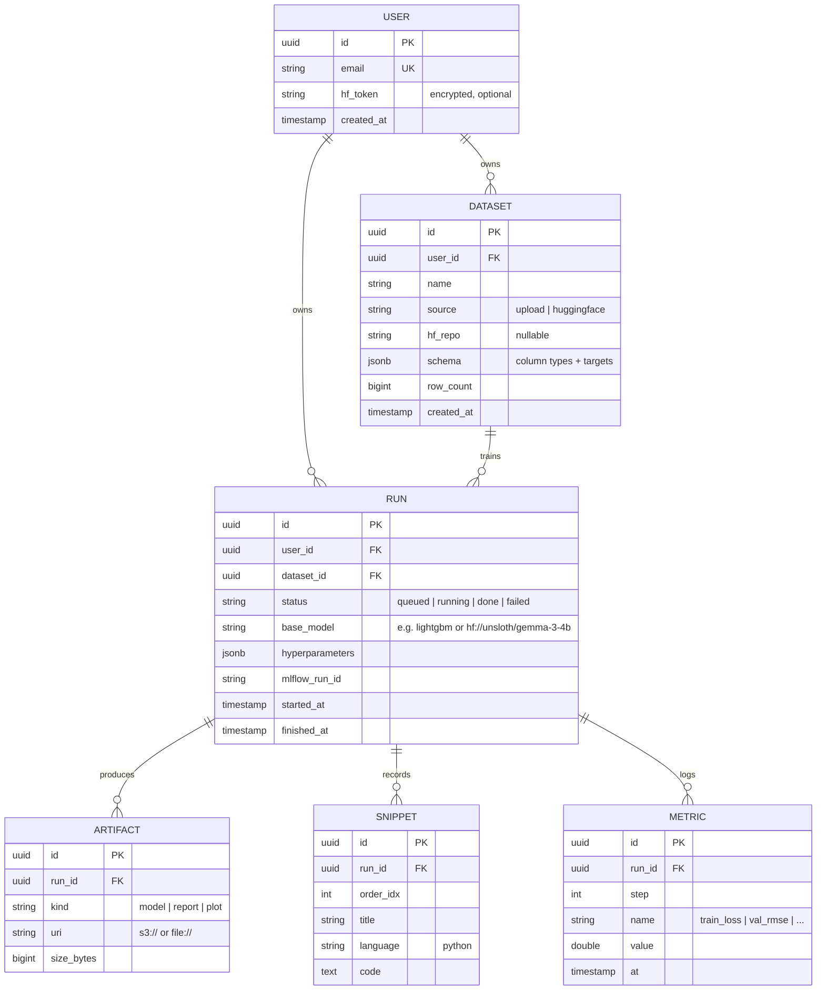

# 03 · Database & Migrations

Schema first. Postgres in dev (via Docker) and prod (Render Postgres). Async SQLAlchemy 2.0. Alembic for migrations.

## The data model

Six tables for the MVP. Read the columns before writing the code — it'll make everything else click.



## SQLAlchemy base + session

`backend/athena/db/base.py`:

```python
from datetime import datetime
from uuid import UUID, uuid4

from sqlalchemy import DateTime, func
from sqlalchemy.orm import DeclarativeBase, Mapped, mapped_column


class Base(DeclarativeBase):
    pass


class TimestampMixin:
    created_at: Mapped[datetime] = mapped_column(
        DateTime(timezone=True),
        server_default=func.now(),
        nullable=False,
    )
```

`backend/athena/db/session.py`:

```python
from collections.abc import AsyncIterator
from contextlib import asynccontextmanager

from sqlalchemy.ext.asyncio import (
    AsyncSession,
    async_sessionmaker,
    create_async_engine,
)

from athena.settings import get_settings

settings = get_settings()

engine = create_async_engine(
    settings.database_url,
    echo=False,
    pool_pre_ping=True,
    pool_size=5,
    max_overflow=10,
)

SessionLocal = async_sessionmaker(
    engine,
    class_=AsyncSession,
    expire_on_commit=False,
)


async def get_session() -> AsyncIterator[AsyncSession]:
    """FastAPI dependency."""
    async with SessionLocal() as session:
        yield session


@asynccontextmanager
async def session_scope() -> AsyncIterator[AsyncSession]:
    """For use in arq jobs and scripts (no DI)."""
    async with SessionLocal() as session:
        try:
            yield session
            await session.commit()
        except Exception:
            await session.rollback()
            raise
```

## ORM models

`backend/athena/db/models.py`:

```python
from datetime import datetime
from typing import Any
from uuid import UUID, uuid4

from sqlalchemy import (
    BigInteger,
    DateTime,
    Float,
    ForeignKey,
    Integer,
    String,
    Text,
    UniqueConstraint,
)
from sqlalchemy.dialects.postgresql import JSONB, UUID as PgUUID
from sqlalchemy.orm import Mapped, mapped_column, relationship

from athena.db.base import Base, TimestampMixin


class User(Base, TimestampMixin):
    __tablename__ = "users"

    id: Mapped[UUID] = mapped_column(PgUUID(as_uuid=True), primary_key=True, default=uuid4)
    email: Mapped[str] = mapped_column(String(255), unique=True, index=True, nullable=False)
    hf_token_encrypted: Mapped[str | None] = mapped_column(Text, nullable=True)

    datasets: Mapped[list["Dataset"]] = relationship(back_populates="user")
    runs: Mapped[list["Run"]] = relationship(back_populates="user")


class Dataset(Base, TimestampMixin):
    __tablename__ = "datasets"

    id: Mapped[UUID] = mapped_column(PgUUID(as_uuid=True), primary_key=True, default=uuid4)
    user_id: Mapped[UUID] = mapped_column(
        PgUUID(as_uuid=True), ForeignKey("users.id", ondelete="CASCADE"), index=True
    )
    name: Mapped[str] = mapped_column(String(255), nullable=False)
    source: Mapped[str] = mapped_column(String(32), nullable=False)  # upload | huggingface
    hf_repo: Mapped[str | None] = mapped_column(String(255), nullable=True)
    schema_json: Mapped[dict[str, Any]] = mapped_column(JSONB, default=dict)
    row_count: Mapped[int] = mapped_column(BigInteger, default=0)
    storage_uri: Mapped[str] = mapped_column(String(512), nullable=False)

    user: Mapped["User"] = relationship(back_populates="datasets")
    runs: Mapped[list["Run"]] = relationship(back_populates="dataset")


class Run(Base, TimestampMixin):
    __tablename__ = "runs"

    id: Mapped[UUID] = mapped_column(PgUUID(as_uuid=True), primary_key=True, default=uuid4)
    user_id: Mapped[UUID] = mapped_column(
        PgUUID(as_uuid=True), ForeignKey("users.id", ondelete="CASCADE"), index=True
    )
    dataset_id: Mapped[UUID] = mapped_column(
        PgUUID(as_uuid=True), ForeignKey("datasets.id", ondelete="CASCADE"), index=True
    )
    status: Mapped[str] = mapped_column(String(32), default="queued", index=True)
    base_model: Mapped[str] = mapped_column(String(255), nullable=False)
    hyperparameters: Mapped[dict[str, Any]] = mapped_column(JSONB, default=dict)
    mlflow_run_id: Mapped[str | None] = mapped_column(String(64), nullable=True, index=True)
    error: Mapped[str | None] = mapped_column(Text, nullable=True)
    started_at: Mapped[datetime | None] = mapped_column(DateTime(timezone=True), nullable=True)
    finished_at: Mapped[datetime | None] = mapped_column(DateTime(timezone=True), nullable=True)

    user: Mapped["User"] = relationship(back_populates="runs")
    dataset: Mapped["Dataset"] = relationship(back_populates="runs")
    artifacts: Mapped[list["Artifact"]] = relationship(back_populates="run", cascade="all, delete-orphan")
    snippets: Mapped[list["Snippet"]] = relationship(back_populates="run", cascade="all, delete-orphan")
    metrics: Mapped[list["Metric"]] = relationship(back_populates="run", cascade="all, delete-orphan")


class Artifact(Base, TimestampMixin):
    __tablename__ = "artifacts"

    id: Mapped[UUID] = mapped_column(PgUUID(as_uuid=True), primary_key=True, default=uuid4)
    run_id: Mapped[UUID] = mapped_column(
        PgUUID(as_uuid=True), ForeignKey("runs.id", ondelete="CASCADE"), index=True
    )
    kind: Mapped[str] = mapped_column(String(32), nullable=False)
    uri: Mapped[str] = mapped_column(String(512), nullable=False)
    size_bytes: Mapped[int] = mapped_column(BigInteger, default=0)

    run: Mapped["Run"] = relationship(back_populates="artifacts")


class Snippet(Base, TimestampMixin):
    __tablename__ = "snippets"
    __table_args__ = (UniqueConstraint("run_id", "order_idx", name="uq_snippet_run_order"),)

    id: Mapped[UUID] = mapped_column(PgUUID(as_uuid=True), primary_key=True, default=uuid4)
    run_id: Mapped[UUID] = mapped_column(
        PgUUID(as_uuid=True), ForeignKey("runs.id", ondelete="CASCADE"), index=True
    )
    order_idx: Mapped[int] = mapped_column(Integer, nullable=False)
    title: Mapped[str] = mapped_column(String(255), nullable=False)
    language: Mapped[str] = mapped_column(String(32), default="python")
    code: Mapped[str] = mapped_column(Text, nullable=False)

    run: Mapped["Run"] = relationship(back_populates="snippets")


class Metric(Base, TimestampMixin):
    __tablename__ = "metrics"

    id: Mapped[UUID] = mapped_column(PgUUID(as_uuid=True), primary_key=True, default=uuid4)
    run_id: Mapped[UUID] = mapped_column(
        PgUUID(as_uuid=True), ForeignKey("runs.id", ondelete="CASCADE"), index=True
    )
    step: Mapped[int] = mapped_column(Integer, nullable=False)
    name: Mapped[str] = mapped_column(String(64), nullable=False, index=True)
    value: Mapped[float] = mapped_column(Float, nullable=False)

    run: Mapped["Run"] = relationship(back_populates="metrics")
```

## Alembic

Initialize:

```bash
cd backend
uv run alembic init -t async alembic
```

This creates `alembic/` and `alembic.ini`. Open `alembic/env.py` and **replace** the import block + `run_migrations_online` section so it uses *our* models and *our* settings:

```python
# alembic/env.py — full file
import asyncio
from logging.config import fileConfig

from alembic import context
from sqlalchemy import pool
from sqlalchemy.engine import Connection
from sqlalchemy.ext.asyncio import async_engine_from_config

from athena.db.base import Base
from athena.db import models  # noqa: F401  -- side-effect import registers models
from athena.settings import get_settings

config = context.config
if config.config_file_name is not None:
    fileConfig(config.config_file_name)

settings = get_settings()
config.set_main_option("sqlalchemy.url", settings.database_url)

target_metadata = Base.metadata


def run_migrations_offline() -> None:
    context.configure(
        url=settings.database_url,
        target_metadata=target_metadata,
        literal_binds=True,
        dialect_opts={"paramstyle": "named"},
    )
    with context.begin_transaction():
        context.run_migrations()


def do_run_migrations(connection: Connection) -> None:
    context.configure(connection=connection, target_metadata=target_metadata)
    with context.begin_transaction():
        context.run_migrations()


async def run_async_migrations() -> None:
    connectable = async_engine_from_config(
        config.get_section(config.config_ini_section, {}),
        prefix="sqlalchemy.",
        poolclass=pool.NullPool,
    )
    async with connectable.connect() as connection:
        await connection.run_sync(do_run_migrations)
    await connectable.dispose()


def run_migrations_online() -> None:
    asyncio.run(run_async_migrations())


if context.is_offline_mode():
    run_migrations_offline()
else:
    run_migrations_online()
```

## First migration

```bash
uv run alembic revision --autogenerate -m "initial schema"
uv run alembic upgrade head
```

Inspect the generated migration in `alembic/versions/` and confirm it created all six tables. If anything looks off, **fix it by editing the migration file** before running `upgrade` — don't autogenerate twice in a row.

Verify in psql:

```bash
docker compose -f infra/docker-compose.yml exec postgres \
  psql -U athena -d athena -c "\dt"
```

You should see `users`, `datasets`, `runs`, `artifacts`, `snippets`, `metrics`, `alembic_version`.

## Wire the session into FastAPI

`backend/athena/deps.py`:

```python
from typing import Annotated

from fastapi import Depends
from sqlalchemy.ext.asyncio import AsyncSession

from athena.db.session import get_session

SessionDep = Annotated[AsyncSession, Depends(get_session)]
```

Now any route that wants the DB takes `session: SessionDep` as a parameter. Clean.

## Definition of done

- [ ] `alembic upgrade head` runs without errors.
- [ ] `psql \dt` shows all six tables + `alembic_version`.
- [ ] `SessionDep` is importable from `athena.deps`.
- [ ] If you nuke the DB (`docker compose down -v && docker compose up -d`) and re-run `alembic upgrade head`, the schema rebuilds identically.

Next: **[04 · Authentication →](04-auth.md)**
