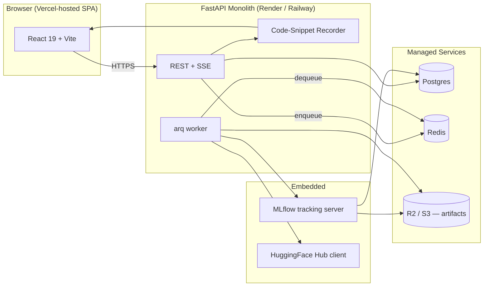

# Athena Docs

Welcome. This site is the **builder's playbook** for Athena — an open-source, web-based, no-code AutoML platform for drug discovery.

If you're trying to **use** Athena, see the landing page at the deployed URL. If you're trying to **build, contribute to, or self-host** Athena, you're in the right place.

## What's in here

-   :material-rocket-launch:{ .lg .middle } **[Implementation](implementation/index.md)**

    ---

    A sequential, nitty-gritty staff-engineer playbook for shipping the monolith — backend skeleton → DB → auth → jobs → MLflow → HuggingFace → frontend → deploy. Includes every command and every file you need to type.

-   :material-crystal-ball:{ .lg .middle } **[Future](future/index.md)**

    ---

    Where Athena is headed: a local-first desktop app via **Tauri** with a bundled Python sidecar, sqlite storage, and auto-updates. Not built yet — design notes only.

## Architecture in one diagram

## Why a monolith?

- One repo, one container, one deploy pipeline.
- MLflow runs **inside** the FastAPI process (sub-app mount) so there's no second service to deploy on day one.
- arq (Redis-backed async job queue) runs as a second process inside the same container — same code, same dependencies.
- When the workload outgrows one box, split the worker out first, then MLflow. You won't have to rewrite anything.

## How to read the Implementation tab

Pages are numbered. **Do them in order.** Each page ends with a "**Definition of done**" checklist — don't move on until you can tick every box.

Code blocks are meant to be typed (or pasted), not skimmed. The point of this playbook is that you understand every line by the time you've finished.
